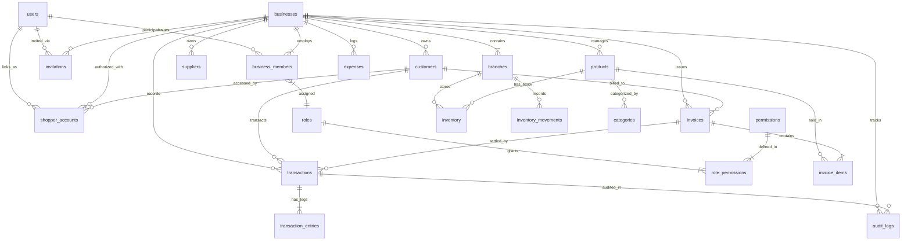

# VyaparOS — Database Schema & Data Architecture Specification

**Document Version:** 2.0.0 (Updated with Firebase UID + Supabase PostgreSQL + Membership & Shopper Architecture)  
**Target Engine:** Supabase PostgreSQL 16+  
**ORM / Data Client:** Prisma ORM & Supabase-JS Type-Safe Bindings

---

## 1. Entity-Relationship Overview (ERD)



---

## 2. Complete Relational Table Definitions (DDL)

### 2.1 Identity, Tenancy & Membership

```sql
-- Global User Profile (Linked to Firebase Authentication)
CREATE TABLE users (
    id UUID PRIMARY KEY DEFAULT gen_random_uuid(),
    firebase_uid VARCHAR(128) UNIQUE NOT NULL, -- Canonical reference to Firebase Auth
    phone_number VARCHAR(15),
    email VARCHAR(255),
    full_name VARCHAR(150) NOT NULL,
    global_role VARCHAR(20) NOT NULL DEFAULT 'SHOPKEEPER', -- 'ADMIN', 'SHOPKEEPER', 'SHOPPER'
    avatar_url TEXT,
    language_preference VARCHAR(10) DEFAULT 'en', -- 'en', 'hi', 'mr'
    is_active BOOLEAN DEFAULT true,
    created_at TIMESTAMPTZ NOT NULL DEFAULT NOW(),
    updated_at TIMESTAMPTZ NOT NULL DEFAULT NOW(),
    deleted_at TIMESTAMPTZ
);

CREATE INDEX idx_users_firebase_uid ON users(firebase_uid);
CREATE INDEX idx_users_phone ON users(phone_number);

-- Business Tenant Master
CREATE TABLE businesses (
    id UUID PRIMARY KEY DEFAULT gen_random_uuid(),
    owner_user_id UUID NOT NULL REFERENCES users(id) ON DELETE RESTRICT,
    name VARCHAR(200) NOT NULL,
    legal_name VARCHAR(250),
    gstin VARCHAR(15),
    pan VARCHAR(10),
    business_type VARCHAR(50) NOT NULL DEFAULT 'retail', -- 'retail', 'wholesale', 'distributor', 'services'
    currency VARCHAR(5) DEFAULT 'INR',
    logo_url TEXT,
    upi_vpa VARCHAR(100),
    bank_account_number VARCHAR(50),
    bank_ifsc_code VARCHAR(15),
    bank_name VARCHAR(100),
    created_at TIMESTAMPTZ NOT NULL DEFAULT NOW(),
    updated_at TIMESTAMPTZ NOT NULL DEFAULT NOW(),
    deleted_at TIMESTAMPTZ
);

CREATE INDEX idx_businesses_owner ON businesses(owner_user_id);
CREATE INDEX idx_businesses_gstin ON businesses(gstin);

-- Physical Branches / Godowns
CREATE TABLE branches (
    id UUID PRIMARY KEY DEFAULT gen_random_uuid(),
    business_id UUID NOT NULL REFERENCES businesses(id) ON DELETE CASCADE,
    name VARCHAR(150) NOT NULL, -- e.g. 'Main Counter', 'Wholesale Godown'
    branch_code VARCHAR(20),
    is_main_branch BOOLEAN DEFAULT false,
    address_line1 TEXT NOT NULL,
    address_line2 TEXT,
    city VARCHAR(100) NOT NULL,
    state_code VARCHAR(2) NOT NULL, -- Indian state code, e.g. '27' (MH)
    state_name VARCHAR(100) NOT NULL,
    pincode VARCHAR(10) NOT NULL,
    contact_phone VARCHAR(15),
    created_at TIMESTAMPTZ NOT NULL DEFAULT NOW(),
    updated_at TIMESTAMPTZ NOT NULL DEFAULT NOW(),
    deleted_at TIMESTAMPTZ
);

CREATE INDEX idx_branches_business ON branches(business_id);

-- System & Custom Business Roles
CREATE TABLE roles (
    id UUID PRIMARY KEY DEFAULT gen_random_uuid(),
    business_id UUID REFERENCES businesses(id) ON DELETE CASCADE, -- NULL for system global defaults
    role_key VARCHAR(50) NOT NULL, -- 'OWNER', 'MANAGER', 'CASHIER', 'SALESPERSON', 'ACCOUNTANT', 'INVENTORY_MANAGER'
    display_name VARCHAR(100) NOT NULL,
    description TEXT,
    is_system_default BOOLEAN DEFAULT false,
    created_at TIMESTAMPTZ NOT NULL DEFAULT NOW()
);

-- Granular Permissions Master
CREATE TABLE permissions (
    id UUID PRIMARY KEY DEFAULT gen_random_uuid(),
    permission_key VARCHAR(100) UNIQUE NOT NULL, -- e.g. 'customer.create', 'transaction.reverse'
    module VARCHAR(50) NOT NULL, -- 'CUSTOMER', 'TRANSACTION', 'INVENTORY', 'STAFF', etc.
    description TEXT NOT NULL
);

-- Role-Permission Mapping
CREATE TABLE role_permissions (
    id UUID PRIMARY KEY DEFAULT gen_random_uuid(),
    role_id UUID NOT NULL REFERENCES roles(id) ON DELETE CASCADE,
    permission_id UUID NOT NULL REFERENCES permissions(id) ON DELETE CASCADE,
    UNIQUE(role_id, permission_id)
);

-- Business Membership Model (Staff & Operators)
CREATE TABLE business_members (
    id UUID PRIMARY KEY DEFAULT gen_random_uuid(),
    business_id UUID NOT NULL REFERENCES businesses(id) ON DELETE CASCADE,
    branch_id UUID REFERENCES branches(id) ON DELETE SET NULL,
    user_id UUID NOT NULL REFERENCES users(id) ON DELETE CASCADE,
    role_id UUID NOT NULL REFERENCES roles(id) ON DELETE RESTRICT,
    status VARCHAR(20) DEFAULT 'ACTIVE', -- 'ACTIVE', 'SUSPENDED', 'INVITED'
    invited_by_user_id UUID REFERENCES users(id),
    created_at TIMESTAMPTZ NOT NULL DEFAULT NOW(),
    updated_at TIMESTAMPTZ NOT NULL DEFAULT NOW(),
    deleted_at TIMESTAMPTZ,
    UNIQUE(business_id, user_id)
);

CREATE INDEX idx_members_business_user ON business_members(business_id, user_id);

-- Staff Invitations
CREATE TABLE invitations (
    id UUID PRIMARY KEY DEFAULT gen_random_uuid(),
    business_id UUID NOT NULL REFERENCES businesses(id) ON DELETE CASCADE,
    branch_id UUID REFERENCES branches(id) ON DELETE SET NULL,
    role_id UUID NOT NULL REFERENCES roles(id) ON DELETE RESTRICT,
    email_or_phone VARCHAR(255) NOT NULL,
    invitation_token VARCHAR(100) UNIQUE NOT NULL,
    status VARCHAR(20) DEFAULT 'PENDING', -- 'PENDING', 'ACCEPTED', 'EXPIRED', 'REVOKED'
    invited_by_user_id UUID NOT NULL REFERENCES users(id),
    expires_at TIMESTAMPTZ NOT NULL,
    created_at TIMESTAMPTZ NOT NULL DEFAULT NOW()
);

-- Shopper (Customer) Account Linkings
CREATE TABLE shopper_accounts (
    id UUID PRIMARY KEY DEFAULT gen_random_uuid(),
    user_id UUID NOT NULL REFERENCES users(id) ON DELETE CASCADE, -- Global User with role 'SHOPPER'
    customer_id UUID NOT NULL, -- References customers(id)
    business_id UUID NOT NULL REFERENCES businesses(id) ON DELETE CASCADE,
    status VARCHAR(20) DEFAULT 'ACTIVE', -- 'ACTIVE', 'PENDING_VERIFICATION', 'REVOKED'
    linked_at TIMESTAMPTZ NOT NULL DEFAULT NOW(),
    UNIQUE(user_id, business_id, customer_id)
);

CREATE INDEX idx_shopper_lookup ON shopper_accounts(user_id, business_id);
```

---

### 2.2 Customer & Supplier Master Ledgers

```sql
-- Customer Directory & Credit Master
CREATE TABLE customers (
    id UUID PRIMARY KEY DEFAULT gen_random_uuid(),
    business_id UUID NOT NULL REFERENCES businesses(id) ON DELETE CASCADE,
    name VARCHAR(150) NOT NULL,
    phone_number VARCHAR(15) NOT NULL,
    email VARCHAR(255),
    address TEXT,
    city VARCHAR(100),
    state_code VARCHAR(2),
    gstin VARCHAR(15),
    credit_limit DECIMAL(14,2) DEFAULT 0.00,
    payment_terms_days INT DEFAULT 0,
    opening_balance DECIMAL(14,2) DEFAULT 0.00, -- Positive: Lena Hai (Receivable), Negative: Advance (Payable)
    outstanding_balance DECIMAL(14,2) DEFAULT 0.00,
    payment_reliability_score INT DEFAULT 750, -- 100 to 900 index
    tags TEXT[] DEFAULT ARRAY[]::TEXT[],
    notes TEXT,
    created_at TIMESTAMPTZ NOT NULL DEFAULT NOW(),
    updated_at TIMESTAMPTZ NOT NULL DEFAULT NOW(),
    deleted_at TIMESTAMPTZ,
    UNIQUE(business_id, phone_number)
);

CREATE INDEX idx_customers_business ON customers(business_id);
CREATE INDEX idx_customers_phone ON customers(business_id, phone_number);

-- Supplier Directory & Payables Master
CREATE TABLE suppliers (
    id UUID PRIMARY KEY DEFAULT gen_random_uuid(),
    business_id UUID NOT NULL REFERENCES businesses(id) ON DELETE CASCADE,
    name VARCHAR(150) NOT NULL,
    company_name VARCHAR(200),
    phone_number VARCHAR(15) NOT NULL,
    email VARCHAR(255),
    address TEXT,
    gstin VARCHAR(15),
    pan VARCHAR(10),
    bank_account_number VARCHAR(50),
    bank_ifsc VARCHAR(15),
    opening_balance DECIMAL(14,2) DEFAULT 0.00, -- Positive: Dena Hai (Payable)
    outstanding_payable DECIMAL(14,2) DEFAULT 0.00,
    payment_terms_days INT DEFAULT 30,
    created_at TIMESTAMPTZ NOT NULL DEFAULT NOW(),
    updated_at TIMESTAMPTZ NOT NULL DEFAULT NOW(),
    deleted_at TIMESTAMPTZ
);

CREATE INDEX idx_suppliers_business ON suppliers(business_id);
```

---

### 2.3 Transactions, Double-Entry & Audit Logs

```sql
-- Unified Financial Transactions (Khata + Cashbook Entries)
CREATE TABLE transactions (
    id UUID PRIMARY KEY DEFAULT gen_random_uuid(),
    business_id UUID NOT NULL REFERENCES businesses(id) ON DELETE CASCADE,
    branch_id UUID REFERENCES branches(id) ON DELETE RESTRICT,
    party_type VARCHAR(20) DEFAULT 'CUSTOMER', -- 'CUSTOMER', 'SUPPLIER', 'OTHER'
    customer_id UUID REFERENCES customers(id) ON DELETE RESTRICT,
    supplier_id UUID REFERENCES suppliers(id) ON DELETE RESTRICT,
    invoice_id UUID, -- Will link to invoices table
    
    transaction_type VARCHAR(30) NOT NULL, -- 'CREDIT_GIVEN' (Udhar), 'PAYMENT_RECEIVED' (Jama), 'SUPPLIER_PAYMENT', 'EXPENSE', 'OPENING_BALANCE'
    amount DECIMAL(14,2) NOT NULL,
    payment_mode VARCHAR(30) NOT NULL DEFAULT 'CASH', -- 'CASH', 'UPI', 'BANK_TRANSFER', 'CHEQUE', 'CREDIT'
    payment_reference VARCHAR(100), -- UPI Ref / UTR / Cheque No
    transaction_date TIMESTAMPTZ NOT NULL DEFAULT NOW(),
    description TEXT,
    created_by_user_id UUID NOT NULL REFERENCES users(id),
    created_at TIMESTAMPTZ NOT NULL DEFAULT NOW(),
    updated_at TIMESTAMPTZ NOT NULL DEFAULT NOW(),
    is_voided BOOLEAN DEFAULT false,
    void_reason TEXT,
    voided_by_user_id UUID REFERENCES users(id),
    voided_at TIMESTAMPTZ
);

CREATE INDEX idx_transactions_business ON transactions(business_id, transaction_date DESC);
CREATE INDEX idx_transactions_customer ON transactions(business_id, customer_id);

-- Double-Entry Ledger Legs (Balanced Accounting Engine)
CREATE TABLE transaction_entries (
    id UUID PRIMARY KEY DEFAULT gen_random_uuid(),
    transaction_id UUID NOT NULL REFERENCES transactions(id) ON DELETE CASCADE,
    account_type VARCHAR(50) NOT NULL, -- 'ACCOUNTS_RECEIVABLE', 'SALES_REVENUE', 'CASH_IN_HAND', 'BANK_ACCOUNT', 'ACCOUNTS_PAYABLE', 'GST_OUTPUT_CGST', 'GST_OUTPUT_SGST', 'EXPENSE_ACCOUNT'
    entry_type VARCHAR(6) NOT NULL, -- 'DEBIT' or 'CREDIT'
    amount DECIMAL(14,2) NOT NULL,
    created_at TIMESTAMPTZ NOT NULL DEFAULT NOW()
);

CREATE INDEX idx_entries_transaction ON transaction_entries(transaction_id);

-- Immutable Security & Financial Audit Logs
CREATE TABLE audit_logs (
    id UUID PRIMARY KEY DEFAULT gen_random_uuid(),
    business_id UUID REFERENCES businesses(id) ON DELETE CASCADE,
    actor_user_id UUID NOT NULL REFERENCES users(id),
    global_role VARCHAR(20) NOT NULL,
    business_role VARCHAR(50),
    action VARCHAR(100) NOT NULL, -- 'CUSTOMER_CREATED', 'TRANSACTION_CREATED', 'TRANSACTION_REVERSED', 'ROLE_CHANGED', 'STAFF_INVITED'
    entity_name VARCHAR(50) NOT NULL,
    entity_id UUID NOT NULL,
    old_state JSONB,
    new_state JSONB,
    ip_address VARCHAR(45),
    user_agent TEXT,
    created_at TIMESTAMPTZ NOT NULL DEFAULT NOW()
);

CREATE INDEX idx_audit_business ON audit_logs(business_id, created_at DESC);
```

---

## 3. Supabase Row-Level Security (RLS) Policies

```sql
-- Enable RLS across tenant tables
ALTER TABLE businesses ENABLE ROW LEVEL SECURITY;
ALTER TABLE customers ENABLE ROW LEVEL SECURITY;
ALTER TABLE transactions ENABLE ROW LEVEL SECURITY;
ALTER TABLE audit_logs ENABLE ROW LEVEL SECURITY;
ALTER TABLE shopper_accounts ENABLE ROW LEVEL SECURITY;

-- Helper Function to resolve current user ID from Firebase JWT Claim
CREATE OR REPLACE FUNCTION auth_user_id() RETURNS UUID AS $$
    SELECT id FROM users WHERE firebase_uid = auth.jwt()->>'sub' LIMIT 1;
$$ LANGUAGE SQL STABLE;

-- Business Isolation Policy for Shopkeepers
CREATE POLICY shopkeeper_business_access ON businesses
    FOR ALL
    USING (
        id IN (
            SELECT business_id FROM business_members 
            WHERE user_id = auth_user_id() AND status = 'ACTIVE'
        )
    );

-- Customer Access Policy (Shopkeeper + Linked Shopper)
CREATE POLICY customer_access_policy ON customers
    FOR ALL
    USING (
        -- Shopkeepers can access customers in their business
        business_id IN (
            SELECT business_id FROM business_members 
            WHERE user_id = auth_user_id() AND status = 'ACTIVE'
        )
        OR
        -- Shoppers can ONLY access their explicitly linked customer record
        id IN (
            SELECT customer_id FROM shopper_accounts 
            WHERE user_id = auth_user_id() AND status = 'ACTIVE'
        )
    );

-- Transaction Access Policy
CREATE POLICY transaction_access_policy ON transactions
    FOR ALL
    USING (
        business_id IN (
            SELECT business_id FROM business_members 
            WHERE user_id = auth_user_id() AND status = 'ACTIVE'
        )
        OR
        customer_id IN (
            SELECT customer_id FROM shopper_accounts 
            WHERE user_id = auth_user_id() AND status = 'ACTIVE'
        )
    );
```
