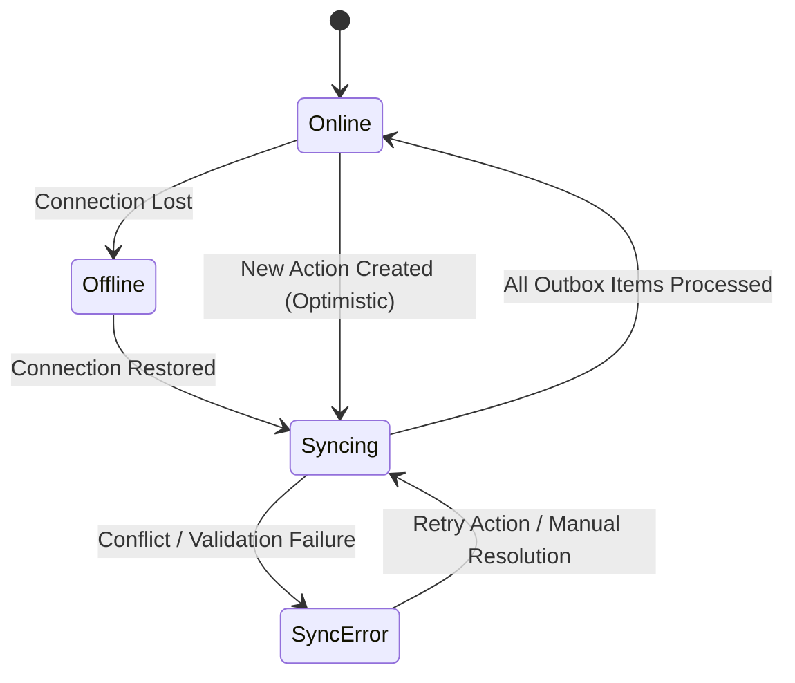
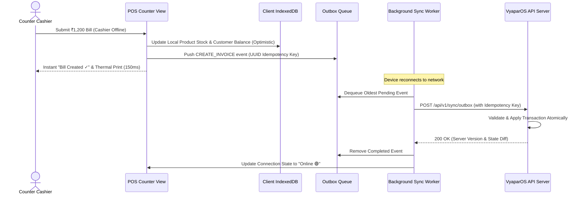

# VyaparOS — Offline-First Architecture & Synchronization Protocol

**Document Version:** 1.0.0  
**Target Performance:** 100% Offline Counter Usability, Zero Data Loss

---

## 1. The Offline-First Mandate

Small merchants in Indian retail markets frequently experience flaky 4G/5G mobile signals, power cuts, and basement connectivity drops. 

**VyaparOS Core Rule:** **No merchant should ever be blocked from billing a customer, recording an udhar entry, or checking stock because the internet is down.**



---

## 2. Client-Side Data Store (IndexedDB via Dexie.js)

The client PWA maintains a fast local replica of the active business dataset:

```typescript
// Dexie.js Client-Side Schema Definition
import Dexie, { Table } from 'dexie';

export interface LocalCustomer {
  id: string;
  businessId: string;
  name: string;
  phoneNumber: string;
  outstandingBalance: number;
  paymentReliabilityScore: number;
  syncStatus: 'SYNCED' | 'PENDING' | 'ERROR';
}

export interface LocalProduct {
  id: string;
  businessId: string;
  name: string;
  barcode: string;
  sku: string;
  sellingPrice: number;
  stockQuantity: number;
  gstRate: number;
  syncStatus: 'SYNCED' | 'PENDING' | 'ERROR';
}

export interface OutboxSyncItem {
  id: string; // UUID (Client-generated idempotency key)
  businessId: string;
  actionType: 'CREATE_INVOICE' | 'ADD_KHATA_ENTRY' | 'CREATE_CUSTOMER' | 'UPDATE_STOCK';
  payload: any;
  createdAt: number; // Client epoch timestamp
  retryCount: number;
  lastError?: string;
}

export class VyaparLocalDatabase extends Dexie {
  customers!: Table<LocalCustomer, string>;
  products!: Table<LocalProduct, string>;
  outbox!: Table<OutboxSyncItem, string>;

  constructor() {
    super('VyaparOS_LocalDB');
    this.version(1).stores({
      customers: 'id, businessId, phoneNumber, syncStatus',
      products: 'id, businessId, barcode, sku, syncStatus',
      outbox: 'id, businessId, actionType, createdAt'
    });
  }
}
```

---

## 3. Optimistic UI & Local Outbox Flow

When a merchant completes a sale or logs an udhar entry offline:



---

## 4. Conflict Resolution Strategy

### Conflict Matrix & Resolution Rules

| Operation Type | Potential Conflict Scenario | VyaparOS Resolution Rule |
| :--- | :--- | :--- |
| **New Invoice Creation** | Created offline simultaneously with another device. | **Idempotent Insertion (No Conflict).** Client generates UUID. Invoices are append-only. |
| **Khata Payment / Udhar** | Two devices record payments for same customer offline. | **Delta-Based Aggregation.** Server adds/subtracts delta values rather than overwriting absolute balance. |
| **Stock Deduction** | Two offline devices sell the last 5 units of an item. | **Server-Authoritative Stock Audit.** Both sales succeed locally. Server logs negative stock adjustment alert with notification to owner: *"Stock deficit of 5 units on Parle-G"*. |
| **Customer Phone Edit** | Two devices edit customer address/phone offline. | **Last-Write-Wins (LWW) with Server Timestamp.** |

---

## 5. Sync Error Handling & Telemetry

1. **Exponential Backoff:** Retries failed sync requests at `2s`, `5s`, `15s`, `30s`, up to max 1 minute intervals.
2. **Permanent Schema Rejection:** If a sync item fails due to validation errors (e.g. invalid GSTIN format), the item is flagged with status `ERROR`, preserved in the local database, and displayed in the **Sync Center Drawer** with a manual "Fix & Retry" prompt.
3. **Bandwidth Optimization:** Payloads are compressed with gzip/brotli. Sync requests batch up to 50 queued outbox actions per HTTP roundtrip.
