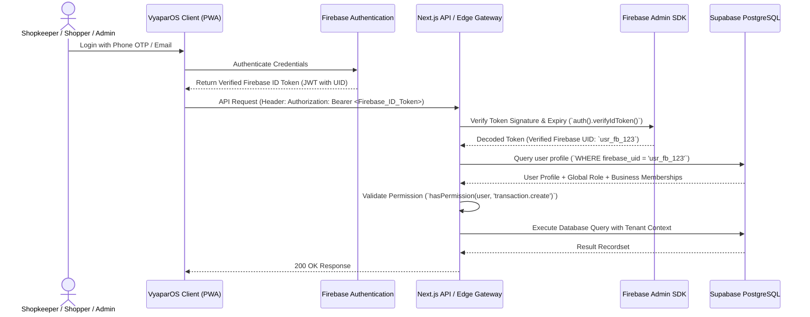

# VyaparOS — Security, Privacy & Compliance Architecture

**Document Version:** 2.0.0 (Updated with Firebase Auth Token Verification + Supabase RLS + Dual-Layer Role Isolation)  
**Compliance Standards:** India DPDP Act 2023, RBI Payment Security Norms, OWASP Top 10

---

## 1. Authentication & Token Verification Flow

VyaparOS relies exclusively on **Firebase Authentication** for identity verification.

---

## 2. Server-Side Security Rules

1. **Never Trust Client-Provided Identities:**
   The backend NEVER reads `user_id`, `firebase_uid`, or `role` from HTTP request bodies or URL parameters. The user's identity is extracted exclusively from the cryptographically verified Firebase ID token.
2. **Global Role Route Separation:**
   - Platform Admin routes (`/admin/*`) strictly require `global_role === 'ADMIN'`.
   - Shopkeeper routes (`/dashboard/*`) strictly require `global_role === 'SHOPKEEPER'` and an active business membership.
   - Shopper routes (`/shopper/*`) strictly require `global_role === 'SHOPPER'`.
3. **Admin Privacy Constraint:**
   Admins cannot casually browse merchant invoices or customer balances. Any support-access session generates an immutable entry in `audit_logs` citing the authorized ticket ID.

---

## 3. Row-Level Security (RLS) & Multi-Tenant Boundaries

Supabase PostgreSQL enforces Row-Level Security:
*   **Tenant Isolation:** Shopkeepers can only read and mutate rows where `business_id` matches their active membership in `business_members`.
*   **Shopper Isolation:** Shoppers can only read specific `invoices` and `transactions` where `customer_id` is linked in `shopper_accounts`.
*   **Staff Role Isolation:** Cashiers cannot query supplier purchase prices or overall business profit aggregates.

---

## 4. Immutable Cryptographic Audit Trail

Every sensitive financial and authorization event records an audit log:
*   `actor_user_id`: Supabase UUID of the authenticated actor.
*   `global_role`: `ADMIN`, `SHOPKEEPER`, or `SHOPPER`.
*   `business_role`: `OWNER`, `MANAGER`, `CASHIER`, etc.
*   `action`: `TRANSACTION_CREATED`, `TRANSACTION_REVERSED`, `CUSTOMER_CREATED`, `STAFF_INVITED`, etc.
*   `entity_name` & `entity_id`: Target resource.
*   `old_state` & `new_state`: JSON diff of changes.
*   `ip_address` & `user_agent`: Client network metadata.
