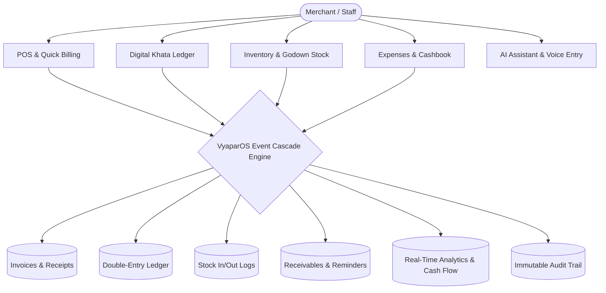

# VyaparOS — Product Requirements Document (PRD)

**Document Version:** 1.0.0  
**Target Release:** Master Implementation  
**Product Classification:** All-in-One Operating System for Indian MSMEs

---

## 1. Vision & Executive Summary

**VyaparOS** is the next-generation operating system built specifically for India’s 63+ million small businesses, retailers, wholesalers, distributors, and service providers. 

Unlike single-purpose digital ledgers or bloated legacy desktop accounting software, VyaparOS delivers a unified, interconnected platform where **Customer Ledgers, GST Billing, Multi-Warehouse Inventory, Cashflow Analytics, Payment Reconciliation, Staff Roles, and Hallucination-Free AI** function as one cohesive, real-time nervous system.

---

## 2. Target User Personas

### Persona 1: Ramesh Kumar — Kirana Shop Owner (Retail)
*   **Profile:** 42 years old, runs a busy neighborhood grocery store in Lucknow with ~250 daily counter transactions and ~60 monthly credit customers (*udhar*).
*   **Primary Needs:** 5-second counter billing, instant udhar logging, polite WhatsApp payment reminders, low-stock alerts on fast-moving spices and pulses.
*   **Key Frustrations:** Forgetting who owes what; math errors during evening rush; awkwardness when asking relatives for pending money.

### Persona 2: Priya Deshmukh — Wholesale FMCG Distributor (B2B Trade)
*   **Profile:** 36 years old, operates a distribution firm in Pune supplying 120 retail shops with 8 sales reps and 2 godowns.
*   **Primary Needs:** Sequential GST tax invoices, batch/expiry tracking, sales rep order taking, e-Way bills, credit limits per retailer, automated GSTR-1 export.
*   **Key Frustrations:** Multi-device sync errors in older software; sales reps making unauthorized discounts; lack of visibility into godown stock.

### Persona 3: Anil Sharma — Electronic Repair & Spare Parts (Services & Trade)
*   **Profile:** 29 years old, runs a mobile & appliance repair shop in Jaipur with 3 technicians.
*   **Primary Needs:** Service job cards, advance token payments, combining labor charges with spare parts billing, customer status updates on WhatsApp.
*   **Key Frustrations:** Mixing service income with hardware retail income; inability to track technician productivity.

### Persona 4: Customer / Retail Buyer (End Consumer)
*   **Profile:** Neighborhood resident buying monthly groceries on store credit.
*   **Primary Needs:** Digital receipt verification, clarity on past payments, easy one-click UPI repayment link, ability to confirm or dispute recorded udhar entries.

---

## 3. Core Functional Requirements

---

### Module 1: Unified Dashboard & Daily Health
*   **REQ-DSH-01:** Real-time summary cards:
    - **Total Receivables (*Lena Hai*)**: Total outstanding credit owed by all customers with count of overdue parties.
    - **Total Payables (*Dena Hai*)**: Total money owed to suppliers and pending purchase bills.
    - **Today's Sales & Collections**: Total billing volume today split into Cash, UPI, Bank, and Credit (*Udhar*).
    - **Net Cash Balance (*Rokad*)**: Live cash-in-hand and bank balances.
    - **Low Stock & Expiry Alerts**: Number of items below minimum safety threshold.
*   **REQ-DSH-02:** Interactive 7-day and 30-day visual charts showing Revenue Velocity vs Collection Trends.
*   **REQ-DSH-03:** Live AI Actionable Pulse (e.g., "*3 high-value invoices totaling ₹18,400 are overdue by 15+ days. Send WhatsApp reminder in 1 click.*").

---

### Module 2: Customer Management & Digital Khata
*   **REQ-CUS-01:** Customer master record containing:
    - Full Name, Mobile Number (primary key for lookup), Secondary Contact, Email.
    - Billing Address, Shipping Address, State Code, GSTIN (optional, with auto-verification regex).
    - Opening Balance (Debit/Credit), Credit Limit (₹), Payment Terms (e.g., Net 15, Net 30, Due on Receipt).
    - Customer Tags (e.g., *VIP*, *Wholesale*, *Delayed Payer*, *Neighborhood*).
*   **REQ-CUS-02:** Customer Profile 360° View:
    - Running ledger balance with color-coded status (*Lena Hai* in Green, *Advance Jama* in Blue).
    - Chronological list of all Invoices, Payments, Udhar entries, Credit Notes, and Adjustments.
    - Statement Generator: Instant PDF export formatted in English, Hindi, or Marathi with date range filter.
*   **REQ-KHT-01:** Transaction Creation:
    - **Udhar (Credit Given):** Amount, Date/Time, Reference Invoice, Item summary, Notes, Attachment (photo of physical slip).
    - **Jama (Payment Received):** Amount, Payment Mode (Cash, UPI, Cheque, Bank Transfer), Settlement Allocation (FIFO against oldest invoice or manual invoice selection).
*   **REQ-KHT-02:** Double-Entry Integrity: Every Khata entry generates balanced ledger legs in background financial journals. Soft-delete only with mandatory void reason and audit log.

---

### Module 3: Billing, POS & Invoicing
*   **REQ-BIL-01:** Dual Billing Modes:
    - **Quick POS Mode:** Optimized for sub-5-second counter billing, continuous barcode scanner support, number pad hotkeys, quick cash tendered calculation.
    - **Standard GST Invoicing Mode:** Detailed B2B tax invoice with multi-tax slabs (CGST, SGST, IGST), HSN/SAC codes, reverse charge, transport details, and e-Way bill fields.
*   **REQ-BIL-02:** Invoice Status Lifecycle: `Draft` ➔ `Issued` ➔ `Partially Paid` ➔ `Paid` ➔ `Overdue` ➔ `Void/Cancelled`.
*   **REQ-BIL-03:** Professional Printing & Sharing:
    - Thermal Print format (2-inch / 58mm and 3-inch / 80mm ESC/POS compatible).
    - Full-page A4 and A5 formats with customizable branding (Logo, Signature, UPI QR code, Bank details, Custom Terms).
    - One-Click WhatsApp Sharing: Generates personalized WhatsApp message with direct PDF link and UPI payment deep link.

---

### Module 4: Inventory & Warehouse Management
*   **REQ-INV-01:** Item Master Attributes:
    - Item Name, SKU, Barcode (EAN-13, Code-128, custom), Category, Brand.
    - Primary Unit (Pcs, Box, Kg, Liter, Meter) with secondary unit conversion (e.g., 1 Box = 24 Pcs).
    - Purchase Price (Tax inclusive / exclusive toggle), Selling Price, Minimum Retail Price (MRP).
    - GST Tax Slab (0%, 5%, 12%, 18%, 28%), HSN Code, Cess Rate.
    - Opening Stock, Minimum Reorder Level, Maximum Stock Threshold, Primary Supplier ID.
*   **REQ-INV-02:** Advanced Batch & Expiry Tracking (Optional toggle per item):
    - Batch Number, Manufacturing Date, Expiry Date, Batch-specific MRP.
    - Near-expiry stock dashboard and automatic FIFO stock depletion.
*   **REQ-INV-03:** Stock Movements & Adjustments:
    - Automatic stock decrement on Sale / Invoice creation.
    - Automatic stock increment on Purchase / Supplier Bill entry.
    - Manual Stock Adjustments: Physical stock audit, Damaged goods, Theft/Loss, Promotional samples with mandatory audit note.

---

### Module 5: Supplier Management & Purchase Orders
*   **REQ-SUP-01:** Supplier master with GSTIN, PAN, Payment Terms, Bank Details, and Opening Balance.
*   **REQ-SUP-02:** Purchase Invoices & Bills: Recording incoming goods, updating item cost prices, tracking input tax credit (ITC), and calculating accounts payable.
*   **REQ-SUP-03:** Purchase Orders (PO): Generating POs, sending to vendors via WhatsApp/Email, and converting PO to Purchase Bill upon goods receipt with partial fulfillment tracking.

---

### Module 6: Cashbook, Expenses & Financial Ledgers
*   **REQ-EXP-01:** Daily Cashbook (*Rokad*): Tracking opening cash, daily cash-ins (sales + collections), daily cash-outs (expenses + supplier payments), and verified closing cash.
*   **REQ-EXP-02:** Expense Tracking: Categorized business expenses (Shop Rent, Electricity, Staff Salaries, Freight/Transport, Chai/Refreshments, Maintenance) with receipt photo attachment.
*   **REQ-EXP-03:** Bank Account Tracking: Multi-account ledger (Current Account, Savings Account, Cash Drawer, Digital Wallets) with transfer between accounts (*Contra Entries*).

---

### Module 7: Automated Payment Reminders & Multi-Channel Messaging
*   **REQ-REM-01:** Smart Reminder Scheduler:
    - Pre-Due Date Alert (e.g., 2 days before due date).
    - Due Date Reminder.
    - Escalated Overdue Alerts (e.g., 3 days overdue, 15 days overdue, 30 days overdue).
*   **REQ-REM-02:** Regional Language Templates: Pre-composed friendly, professional, and firm templates in English, Hindi (हिन्दी), and Marathi (मराठी).
*   **REQ-REM-03:** Embedded Dynamic UPI QR / Link: Reminders automatically embed the exact merchant UPI deep link so the customer can pay immediately via GPay, PhonePe, or Paytm.

---

### Module 8: Safe AI Copilot & Voice Transaction Assistant
*   **REQ-AI-01: Deterministic Semantic Query Engine:**
    - The AI assistant interprets natural language questions from the merchant:
      - "*Who owes me the most money this week?*"
      - "*Which items in my godown are running low on stock?*"
      - "*How much did I spend on electricity and tea last month?*"
      - "*Compare my July sales with August sales.*"
    - **Zero Hallucination Guarantee:** The LLM translates the query into a structured, validated SQL query against the tenant's isolated database, executes it via secure backend functions, and synthesizes the exact numerical output into a conversational response.
*   **REQ-AI-02: Indian Voice-to-Transaction Parser:**
    - Merchant speaks in conversational Hinglish/Hindi/Marathi/English:
      "*Ramesh ko 500 rupaye ka aata udhar diya.*"
    - The speech parser extracts entity parameters:
      `Customer: Ramesh`, `Type: Udhar (Credit Sale)`, `Amount: ₹500`, `Item: Aata`.
    - **Mandatory Confirmation Modal:** Never commits money directly. Displays a confirmation sheet with primary action button: "*Confirm ₹500 Udhar to Ramesh?*".

---

### Module 9: Merchant Credit Reliability Intelligence
*   **REQ-CRD-01:** Internal Payment Reliability Index (Score range 100–900):
    - Computes customer score based on historical transaction frequency, average payment delay days, percentage of overdue bills, and dispute history.
    - Visual risk badge displayed on counter billing screen:
      - 🟢 **High Reliability (750–900)**: Prompt payer, eligible for higher credit limit.
      - 🟡 **Moderate Reliability (550–749)**: Occasional delay (avg 7–14 days), caution on large credit.
      - 🔴 **High Risk (< 550)**: Frequent defaulter, recommend cash/prepaid billing.
*   **REQ-CRD-02: Compliance Safeguard:** Explicitly labeled as "Merchant-Internal Payment Reliability". Data is strictly isolated within the merchant's tenant and never exposed to other merchants or public bureaus without lawful authorization.

---

### Module 10: Customer Self-Service Portal & Transaction Acknowledgement
*   **REQ-POR-01:** Customer Web Portal (Tokenized Secure Link):
    - Customers receive a secure, short link via SMS/WhatsApp to view their live statement.
    - View itemized bills, download PDF invoices, and review payment history.
*   **REQ-POR-02:** Transaction Acknowledgement & Dispute Resolution:
    - Customer can mark a recent credit entry as **"Confirmed ✓"** or **"Disputed ⚠"** with a dispute note/photo.
    - Merchant dashboard flags disputed entries immediately, preventing year-end reconciliation battles.

---

### Module 11: Multi-Staff Roles & Granular Permissions (RBAC)
*   **REQ-STF-01:** Predefined and Customizable Roles:
    - **Owner / Super Admin:** Unrestricted access to all branches, profit reports, and settings.
    - **Branch Manager:** Full control over designated branch, inventory, and staff.
    - **Counter Cashier / Biller:** Can create sales, accept payments, and search items; cannot view purchase costs, overall profits, or delete transactions.
    - **Salesperson / Delivery Rep:** Can view assigned customers and create draft orders/delivery slips.
    - **Chartered Accountant (CA) / Auditor:** Read-only access to GST reports, ledgers, and trial balance with export rights.

---

### Module 12: Multi-Business & Multi-Branch Architecture
*   **REQ-MBR-01:** Single user identity can own or be invited to multiple independent businesses (e.g., *Ramesh Grocery Store* and *Ramesh Hardware*).
*   **REQ-MBR-02:** Multi-Branch support per business: Multiple physical counter locations or godowns with inter-branch stock transfers and consolidated/branch-wise reporting.

---

## 4. Non-Functional Requirements (NFRs)

| Category | Requirement | Metric / Specification |
| :--- | :--- | :--- |
| **Performance** | Sub-second UI interactions; instant counter billing | Initial page load < 1.2s; counter billing save < 300ms; client PWA bundle < 350KB. |
| **Offline Reliability** | Complete offline resilience for core transactions | 100% of sales, khata, and customer creations operate without internet; automatic background sync upon reconnection. |
| **Data Integrity** | Immutable financial audit trail | Append-only ledger logs; financial records cannot be mutated without creating balancing reversal entries. |
| **Security & Privacy** | Multi-tenant isolation & DPDP Act compliance | Row-Level Security (RLS) enforcement on all queries; encrypted JWT sessions; zero credential exposure in client bundle. |
| **Accessibility & i18n**| Multilingual accessibility | Full UI localization in English, Hindi, and Marathi; support for Indian numerical formatting (₹ 1,00,000.00). |
| **Device Compatibility**| Broad Indian device spectrum | Responsive layout for 320px mobile screens up to 4K desktop displays; ESC/POS thermal printer standard support. |

---

## 5. Subscription & Entitlement Architecture

VyaparOS implements a scalable entitlement-based subscription engine (Free, Pro, Business, Enterprise):

| Plan | Target User | Key Feature Entitlements | Limits |
| :--- | :--- | :--- | :--- |
| **Free (Starter)** | Solo Kirana / Micro-merchant | Digital Khata, Customers, Basic Cashbook, Payment Reminders (manual WhatsApp). | 1 Business, 1 Staff, up to 100 Customers. |
| **Pro** | Growing Retail Store | Full GST Billing, Inventory Tracking, Low Stock Alerts, Thermal POS Printing, Automated WhatsApp Reminders. | 1 Business, 1 Branch, up to 3 Staff, Unlimited Customers. |
| **Business** | High-Volume Wholesaler / Distributor | Multi-Warehouse Inventory, Batch & Expiry Tracking, e-Way Bills, Granular RBAC, AI Business Copilot, Voice Entry. | Up to 3 Businesses, 5 Branches, 15 Staff Accounts. |
| **Enterprise** | Multi-Branch Chain / Franchise | Custom integrations, Dedicated API access, Custom deployment, Multi-entity consolidation, Priority CA support. | Unlimited Branches, Custom Staff, Dedicated SLA. |
